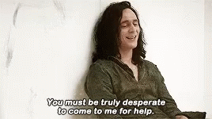

    

    

    I am an Undergraduate in Computer Science and Engineering.

    
    
    
    
    
    
    

<h3 align="center" style="font-family: monospace;">
    I'd like to work together
</h3>

    

    
    
    

<table align="center">
    <tr border="none">
        <td>
            <kbd></kbd>
        </td>
<td>

</td>
        <td>
            <kbd></kbd>
        </td>
    </tr>
</table>
